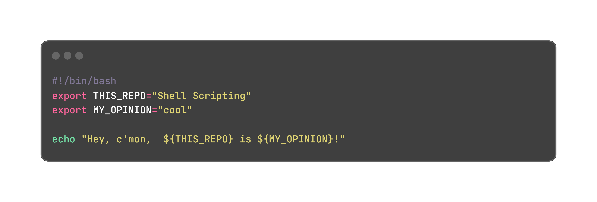

# Shell Scripting with Bash
Practicing Shell scripting with simple automation tasks and solved exercises taken from online courses.

## References
* Jason Cannon - **Shell Scripting: Discover How to Automate Command Line Tasks** @ [Udemy](https://www.udemy.com/course/shell-scripting-linux/?couponCode=24T1MT101824)
* Noah Gift, Alfredo Deza & Kennedy Behrman - **Linux and Bash for Data Engineering** @ [Coursera](https://www.coursera.org/learn/linux-and-bash-for-data-engineering-duke)

